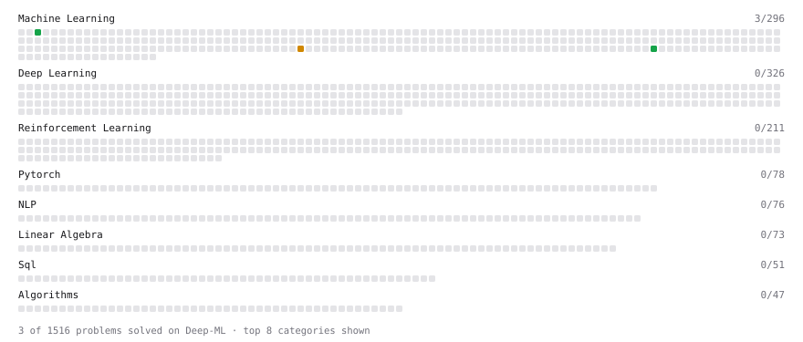

# Deep-ML

My machine learning practice from [Deep-ML](https://www.deep-ml.com). Every solution here was written by hand.

**5** solved · 0 problems · 0 labs · 5 math

[**Browse the interactive portfolio**](https://naveen-poliasetty.github.io/deep-ml/) to replay this filling in over time.

## Math

| | Difficulty | Solved | |
| --- | --- | --- | --- |
| [Derivatives and Gradients](https://www.deep-ml.com/math-problems/1) | easy | 2026-09-28 | [solution](math/0001-derivatives-and-gradients) |
| [Descriptive Statistics](https://www.deep-ml.com/math-problems/18) | easy | 2026-09-28 | [solution](math/0018-descriptive-statistics) |
| [Gradient Descent Updates](https://www.deep-ml.com/math-problems/5) | easy | 2026-09-28 | [solution](math/0005-gradient-descent-updates) |
| [ML Workflow Basics](https://www.deep-ml.com/math-problems/30) | easy | 2026-09-28 | [solution](math/0030-ml-workflow-basics) |
| [Least Squares and the Normal Equations](https://www.deep-ml.com/math-problems/34) | medium | 2026-09-28 | [solution](math/0034-least-squares-and-the-normal-equations) |

---

_This file is regenerated by Deep-ML on every push._
